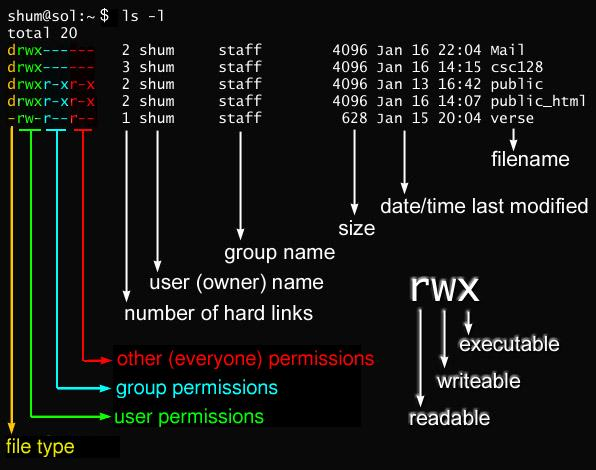

# Permisos de administrador 

Debido a la gran vulnerabilidad potencial al momento de proporcionar acceso local a cualquier archivo, es posible que existan problemas al no asignar los permisos adecuados a un archivo en específico o peor, una carpeta de trabajo. Entonces, en función de la necesidad de los permisos adecuados, repasaremos las formas de asignar permisos y les mostraremos algunos ejemplos en los que puede ser necesaria la modificación.

¿Cómo visualizar los permisos en la terminal?

Se pueden ver los permisos verificando los permisos de archivo o directorio ejecutando el siguiente comando

```bash
ls -l
```

Aparecerá algo similar a la imagen de abajo

# 

#### Tipos de permisos 

* Lectura (readable) - se refiere a la capacidad de un usuario para leer el contenido del archivo.
* Escritura (writeable) - se refueren a la capacidad de un usuario para escribir o modificar un archivo o directorio.
* Ejecución (executable) - el permiso de ejecución afecta la capacidad de un usuario para ejecutar un archivo o ver el contenido de un directorio.

|   | r | w | x |
| -------- | -------- | -------- | -------- |
| 0 | <span style="color:blue"> *0*</span> | <span style="color:yellow"> *0*</span> |  <span style="color:green"> *0*</span> |
| 1 | <span style="color:blue"> *0*</span> |  <span style="color:yellow"> *0*</span> |  <span style="color:green"> *1*</span> |
| 2 | <span style="color:blue"> *0*</span> |  <span style="color:yellow"> *1*</span> |  <span style="color:green"> *0*</span> |
| 3 | <span style="color:blue"> *0*</span> |  <span style="color:yellow"> *1*</span> | <span style="color:green"> *1*</span> |
| 4 | <span style="color:blue"> *1*</span> |  <span style="color:yellow"> *0*</span> |  <span style="color:green"> *0*</span> |
| 5 | <span style="color:blue"> *1*</span> |  <span style="color:yellow"> *0*</span> | <span style="color:green"> *1*</span> |
| 6 | <span style="color:blue"> *1*</span> |  <span style="color:yellow"> *1*</span> |  <span style="color:green"> *0*</span> |
| 7 | <span style="color:blue"> *1*</span> |  <span style="color:yellow"> *1*</span> | <span style="color:green"> *1*</span> |

## Sistema binario 

## Sistema decimal
```bash
784
```
7x10<sup>2</sup> = 700 + 8x10<sup>1</sup> + 4x10<sup>0</sup> = 700 + 80 + 4 = 784

## Sistema binario 

```bash
110
```
1x2<sup>2</sup> + 1x2<sup>1</sup> + 0x2<sup>0</sup> = 4 + 2 + 0 = 6

### ¡Atento!

La posición del dígito importa. Si la posición vale 1, los valores posibles son: Lectura = 4, Escritura = 2, Ejecución = 0

## Permisos comunes

|Configuración |Número | Significado |
| -------- | -------- | -------- |
| -rw------- | 600 | Únicamente el propietario (*owner*) tiene permisos de *lectura* (readable) y *escritura* (writeable). |
| -rw-r--r-- | 644 | Sólamente el *owner* tiene permisos de  *lectura* y *escritura*; el grupo y otros tienen acceso a *lectura*.
| -rwx------ | 700 | Solo el *owner* tiene permisos de *lectura* y *ejecución* (executable). |
| -rwxr-xr-x | 755 | El *owner* tiene permisos de *lectura*, *escritura* y *ejecución*; el grupo y otros solamente tienen acceso a *lectura* y *ejecución*. | 
| -rwx--x--x | 711 | El *owner* tiene permisos de *lectura*, *escritura*, y *ejecución*; el grupo y otros únicamente de *ejecución*. | 
| -rw-rw-rw-- | 666 | Todos tienen acceso a *lectura* y *escritura* en el archivo. **Usarlo de ser extremadamente necesario** | 
| rwxrwxrwx | 777 | Todos tienen acceso total a *escritura*, *lectura*, y *ejecución*. **Estos permisos pueden ser peligrosos** |
| | |

